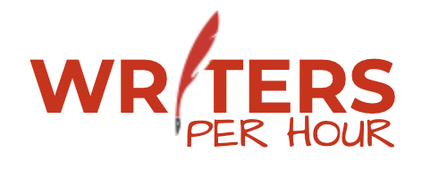
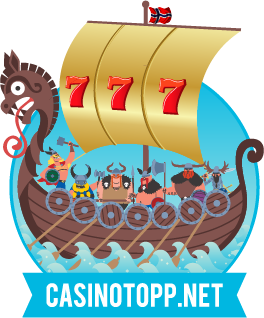
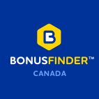
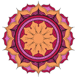
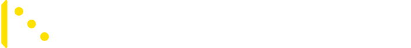
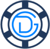
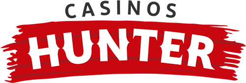
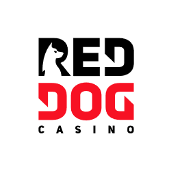

# Support my Projects

Hi! Noty.js and [my other libraries](https://github.com/needim) are MIT licensed open source projects and they are completely free to use.
However, the amount of effort needed to maintain and develop new features for these projects is not sustainable without proper financial backing.
You can support my works by <a href="https://www.patreon.com/bePatron?u=5075261">pledging on Patreon</a> (recurring, with perks for different tiers).

<a class="jmgFob" href="https://www.patreon.com/bePatron?u=5075261" data-patreon-widget-type="become-patron-button">
  <svg viewBox="0 0 569 546" version="1.1" xmlns="http://www.w3.org/2000/svg"><title>Patreon logo</title><g><circle data-color="1" id="Oval" cx="362.589996" cy="204.589996" r="204.589996"></circle><rect data-color="2" id="Rectangle" x="0" y="0" width="100" height="545.799988"></rect></g></svg>
  Become a Sponsor or Baker!
</a>

## Current Sponsors

    

    

    

    

    

    

    

    

    

    

!> **$30 or more per month**   I'll put your logo on all my project's websites & GitHub readme pages. (for the period of subscription) (**30k+ unique pageviews**)

## Current Bakers

- Your name
- Your name
- ...

!> **$1 or more per month**   I'll put your name on all my project's websites bakers page & GitHub repo bakers.md. (for the period of subscription)
