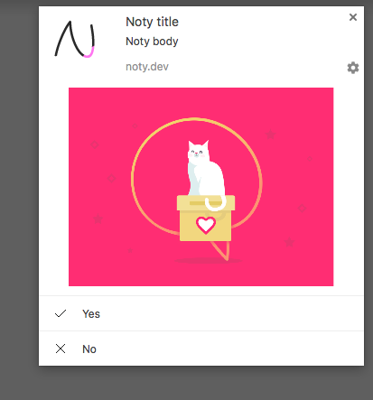

With v3.1.0-beta push notifications are supported with service worker implementation.

### Preparation Steps

* 1) Create a project on the [Firebase Developer Console](https://console.firebase.google.com/).
* 2) Go to **Project settings** (The cog near the top left corner), click the ' **Cloud Messaging**' tab.
* 3) Note that **Server Key** and **Sender ID**.
* 4) Create a copy of [manifest.json.template](https://github.com/needim/noty/blob/master/manifest.json.template) called **manifest.json** at root folder
* 5) Replace <your-sender-id> in your new manifest.json with your own Sender ID from the Firebase Developer Console project.
* 6) Create a copy of [service-worker.js.template](https://github.com/needim/noty/blob/master/service-worker.js.template) called **service-worker.js** at root folder
* 7) Link your manifest <link rel="manifest" href="../manifest.json">

##### Now half of the job is done.

### Let's create a Noty.Push instance

```javascript
const NotyPush = Noty.Push('/service-worker.js')
  .on('onPermissionGranted', function () {
    console.log('Perm: granted')
  })
  .on('onPermissionDenied', function () {
    console.log('Perm: denied')
  })
  .on('onSubscriptionSuccess', function (subData) {
    console.log('Subscription:', subData)
    // (YOU NEED TO STORE THIS VALUES FOR LATER USE)
  })
  .on('onSubscriptionCancel', function (subData) {
    console.log('Subscription: canceled')
  })
  .on('onWorkerSuccess', function () {
    console.log('Worker: installed')
  })
  .on('onWorkerError', function (err) {
    console.log('Worker: failed', err)
  })
  .on('onWorkerNotSupported', function (err) {
    console.log('Worker: not supported', err)
  })
```

### Let's Ask User's Permission

```javascript
NotyPush.requestSubscription()
```

Now the browser will ask permission. And if the user allows it, the service worker will be registered.

!> **You have to store subData onSubscriptionSuccess callback for later use.**

### Sending push notifications from backend (Node.js)

Now that we have subscription information, we can send notifications with [**web-push**](https://github.com/web-push-libs/web-push) library.

Let's install [**web-push**](https://github.com/web-push-libs/web-push) first.

```
$ npm install web-push
```

Create a JavaScript file called sendPushExample.js

```javascript
const webpush = require('web-push')

const vapidKeys = webpush.generateVAPIDKeys()

webpush.setGCMAPIKey('YOUR-SERVER-KEY-FROM-FIREBASE-CONSOLE')

webpush.setVapidDetails(
  'mailto:your@email.com',
  vapidKeys.publicKey,
  vapidKeys.privateKey
)

// Use your previously saved subscription information
const pushSubscription = {
  endpoint: '',
  keys: {
    auth: '',
    p256dh: ''
  }
}

// image & actions are optional
webpush.sendNotification(pushSubscription, JSON.stringify({
  title: 'Noty title',
  body: 'Noty body',
  icon: 'https://your-icon0-url.png',
  image: 'https://your-image-url.png',
  url: 'http://ned.im/noty/?ref=webPushTest',
  actions: [
    {action: 'actionYes', 'title': 'Yes', 'icon': 'https://your-icon1-url.png'},
    {action: 'actionNo', 'title': 'No', 'icon': 'https://your-icon2-url.png'}
  ]
}))
```

After that we can run

```
$ node sendPushExample.js
```

Notification should look like this for Chrome



### Checking user's current permission

```javascript
NotyPush.getPermissionStatus() === 'granted'
NotyPush.getPermissionStatus() === 'default'
NotyPush.getPermissionStatus() === 'denied'

// In some cases, you may need to check
// whether your service worker is running.
NotyPush.isSWRegistered() === true

// You may ask again for permission,
// If user's permission granted
// but service worker unregistered or not working.
```
